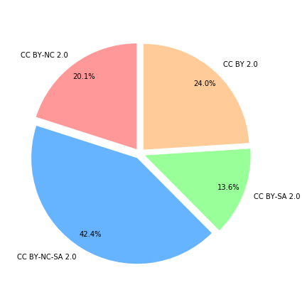
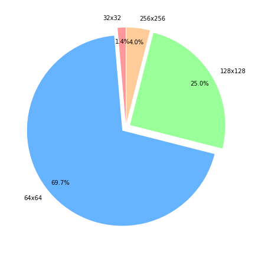

# Flickr Diverse Faces - FDF
Flickr Diverse Faces (FDF) is a dataset with **1.5M faces** "in the wild".
FDF has a large diversity in terms of facial pose, age, ethnicity, occluding objects, facial painting, and image background.
The dataset is designed for generative models for face anonymization, and it was released with the paper "*DeepPrivacy: A Generative Adversarial Network for Face Anonymization.*


The dataset was crawled from the website Flickr ([YFCC-100M dataset](http://projects.dfki.uni-kl.de/yfcc100m/)) and automatically annotated.
Each face is annotated with **7 facial landmarks** (left/right ear, lef/right eye, left/right shoulder, and nose), and a **bounding box** of the face. [Our paper]() goes into more detail about the automatic annotation.


## Licenses
The images are collected from images in the YFCC-100M dataset and each image in our dataset is free to use for **academic** or **open source** projects.
For each face, the corresponding original license is given in the metadata. Some of the images require giving proper credit to the original author, as well as indicating any changes that were made to the images. The original author is given in the metadata.

The dataset contains images with the following licenses:
 - [CC BY-NC-SA 2.0](https://creativecommons.org/licenses/by-nc-sa/2.0/): 623,598 Images (23.4 GB)
 - [CC BY-SA 2.0](https://creativecommons.org/licenses/by-sa/2.0/): 199,502 Images 7.4 GB)
- [CC BY 2.0](https://creativecommons.org/licenses/by/2.0/): 352,961 Images (13.1 GB)
- [CC BY-NC 2.0](https://creativecommons.org/licenses/by-nc/2.0/): 295,192 Images (10.9 GB)

The FDF metadata is under [Apache 2.0 License](https://www.apache.org/licenses/LICENSE-2.0).

## Citation
If you find this code or dataset useful, please cite the following:
```
@InProceedings{10.1007/978-3-030-33720-9_44,
author="Hukkel{\aa}s, H{\aa}kon
and Mester, Rudolf
and Lindseth, Frank",
title="DeepPrivacy: A Generative Adversarial Network for Face Anonymization",
booktitle="Advances in Visual Computing",
year="2019",
publisher="Springer International Publishing",
pages="565--578",
isbn="978-3-030-33720-9"
}
```

## Download

1. First, install dependencies:

```bash
pip install wget, tqdm
```

2. To download metadata, run (expects python 3.6+): 

```
python download.py --target_directory data/fdf
```

3. If you want to download including images:
```
python download.py --target_directory data/fdf --download_images
```


## Metainfo
For each face in the dataset, follows the following metainfo:

```
```

## Statistics
#### Distribution of image licenses



### Training vs Validation Percentage
There are 50,000 validation images, 1,421,253 training images.


### Original Face size
Each face in the original image has a resolution of minimum: 



## Citation
If you find the dataset useful, please cite the following:
```
@InProceedings{10.1007/978-3-030-33720-9_44,
author="Hukkel{\aa}s, H{\aa}kon
and Mester, Rudolf
and Lindseth, Frank",
title="DeepPrivacy: A Generative Adversarial Network for Face Anonymization",
booktitle="Advances in Visual Computing",
year="2019",
publisher="Springer International Publishing",
pages="565--578",
isbn="978-3-030-33720-9"
}
```
